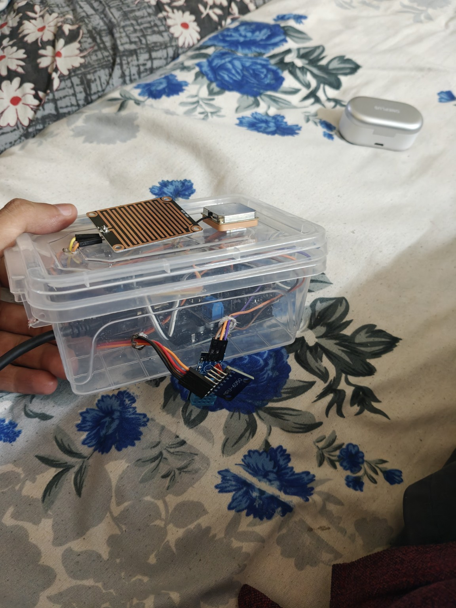
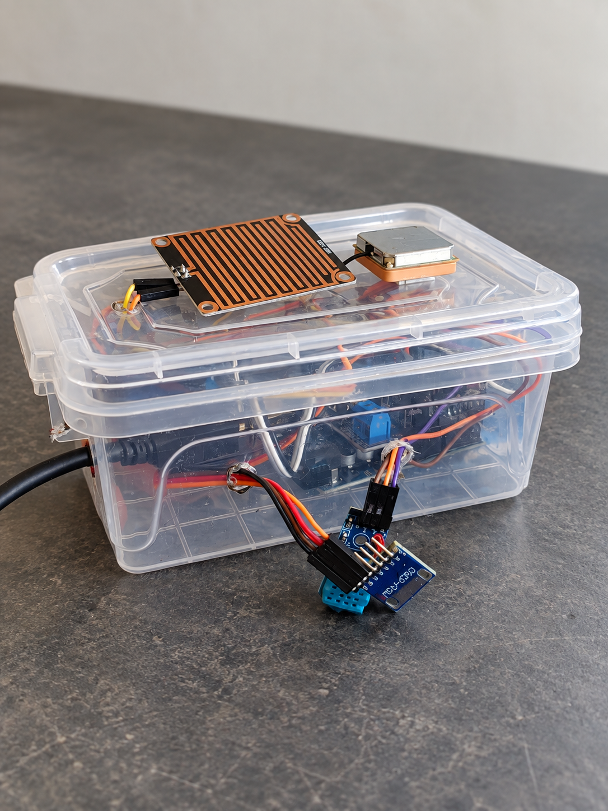

# Road-sensing prototype

A third-year college minor project exploring how a low-cost sensor unit on service vehicles could gather location-linked road observations for later inspection and mapping.

## Prototype and idea

I assembled a microcontroller-based sensor prototype in a clear enclosure. The concept was to collect readings along regular vehicle routes, associate observations with location, and look for road stretches that may need inspection. It connected embedded hardware and sensing with a real infrastructure problem.

**Status:** early proof of concept. The vehicle-mounted collection and geographic mapping workflow were proposed directions; this repository does not claim a fleet deployment, validated defect detection, or a production system. Making measurements reliable on moving vehicles and evaluating whether the data are useful would be further engineering work.

## Images

### Actual prototype

### Edited visual

A clearer edited visual of the enclosure for presentation; the original photo above is the evidence of the physical build.

## Notes

This is a project record and visual showcase. It contains no firmware, dataset, field test results, or performance claims. I will add technical documentation when it is verified and ready to share.
